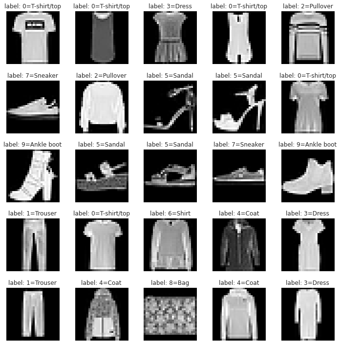
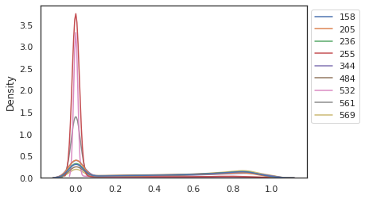
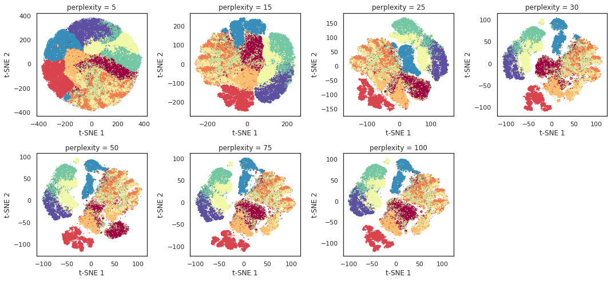
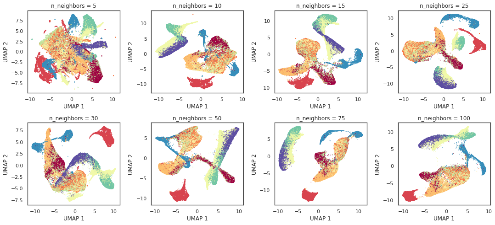
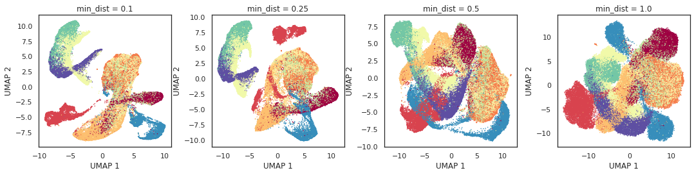
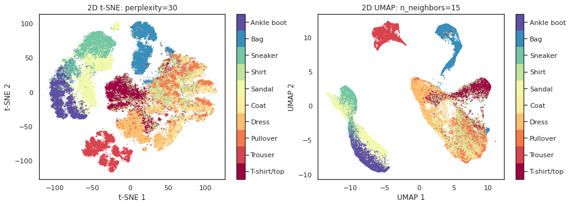
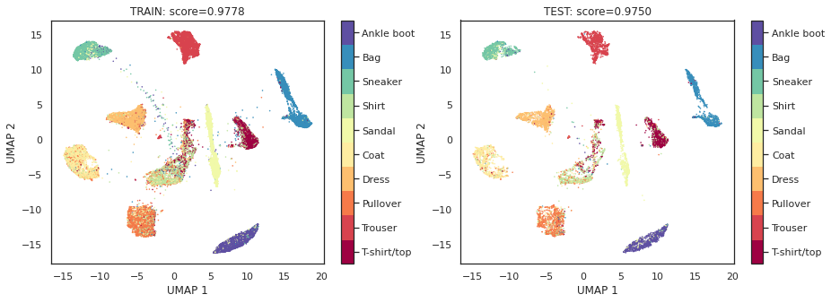
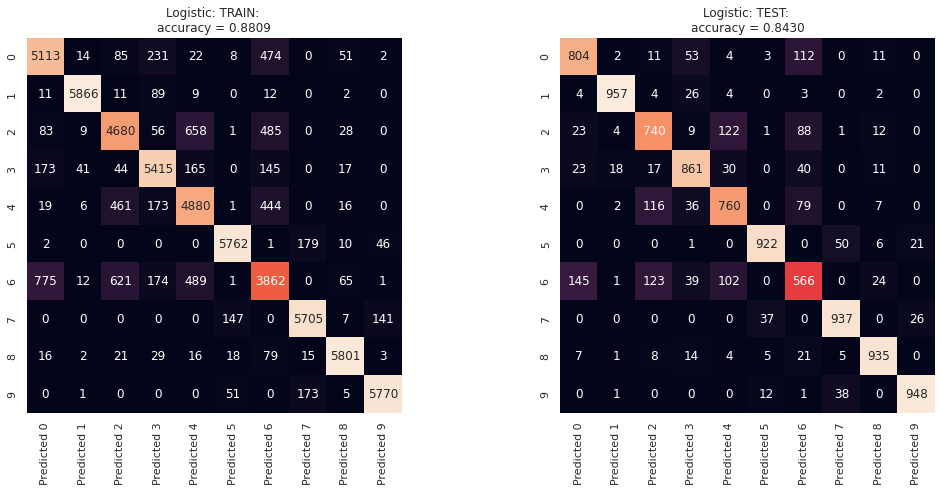
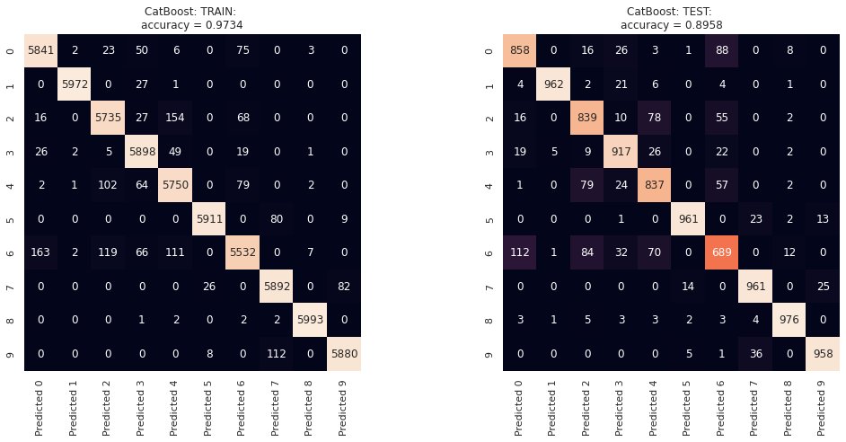

# Fashion-MNIST
I would like to share my ML project on the [fashion-MNIST](https://github.com/zalandoresearch/fashion-mnist) dataset. More informations on the dataset and benchmark can be found via [Zalando Research](https://github.com/zalandoresearch/fashion-mnist) and [Kaggle](https://www.kaggle.com/zalando-research/fashionmnist)

## Data Exploration
Fashion-MNIST is a balanced dataset of 10 classes (labels), consiting of 60,000 images as the training set and 6,000 images as the testing set. Each image is a 28x28 pixel grayscale image, which can be directly flatten to 784 features. Given that pixel values is between 0 and 255. The dataset is normalized by a simple division by 255, yielding the data to a scale between 0 and 1.

| Label | Description |
| --- | --- |
|  0  | T-shirt/top |
|  1  | Trouser |
|  2  | Pullover |
|  3  | Dress |
|  4  | Coat |
|  5  | Sandal |
|  6  | Shirt |
|  7  | Sneaker |
|  8  | Bag |
|  9  | Ankle boot |

Data distribution of 10 randomly-selected features were ploted, showing the non-gaussian distributions. Furthermore, as shown in the [notebook](./Fashion_MNIST_pipeline.ipynb), the data fail the normality test (p-values = 0), confirming the non-gaussian behaviour. While the gaussian distribution offers advantages in many parametic based classifiers and statistical tools, one key approach is thus to transform the dataset to be guassian-like. However, in this project, we will focus on developing ML models without data transformation, leaving the ML algorithms to struggle these non-gaussian nature of dataset.

## Clustering
To have a sense of how the dataset could look like in 2D and what a chance of data clustering, t-SNE and UMAP are chosen here. Both t-SNE and UMAP are nonlinear dimensionality reduction techniques. The orginal 784 features are reduced to 2 features, and the dataset then can be visualized in 2D plot. It's important to note that the analysis below is carried out on GPU node, using RAPIDS's cuML library.

### 2D t-SNE

A key parameter for t-SNE is perplexity. The dependence of 2D t-SNE on perplexity is shown below. 

### 2D UMAP
Key parameters for UMAP are n_neighbors and min_dist. The dependences of 2D UMAP on n_neighbors and min_dist are shown below. 

### Comparison of t-SNE and UMAP

Data visualizations of t-SNE- and UMAP- embeded in 2D plot are presented. While both plots show the similar 5 clusters, UMAP provides the clear separation of 3 single-label clusters and 2 mixed-label clusters, including  
(1) trouser,  
(2) bag, 
(3) t-shirt,  
(4) angle boot, sneaker and sandle, and  
(5) shirt, coat, dress and pullover. 

Therefore, we could speculate the difficulty in classifying the mixed-label groups.

### Manifold Learning: UMAP Clustering with Trustworthiness Scores

If we allow UMAP to learn with known labels, can we develope the menifold embeded model that can cluster the unseen test set? The result is shown below. 

UMAP can learn and compute the cluster of the never-seen-before data quite accuratly. Trustworthiness scores >0.95 in both training and test set, showing that the original data’s structure is very well preserved after dimensionality reduction.

## Classification
Next we develop 3 supervised ML model to classify the Fashion-MNIST dataset, including logistic regression, XGBoost, and CatBoost. Among three ML algoriths, CatBoost gain the highest accuracy of 0.90, owning the capability to accuratly classify (less confused) the two mixed-label group seen earlier in 2D-UMAP visualization. The confusion metrix of these models presented below.

### Logistic Regression

### XGBoost

### CatBoost

## Requirements
- TensorFlow
- Scikit-learn
- cuDF - GPU DataFrames
- cuML - GPU Machine Learning Algorithms

## References
[1] [Fashion-MNIST](https://github.com/zalandoresearch/fashion-mnist) 
[2] [RAPIDS-cuML](https://github.com/rapidsai/cuml) 
[3] [scikit-learn](https://github.com/scikit-learn/scikit-learn) 
[5] [UMAP](https://github.com/lmcinnes/umap) 
[4] [XGBoost](https://github.com/dmlc/xgboost) 
[4] [CatBoost](https://github.com/catboost) 

## Author
Kanokkorn Pimcharoen
